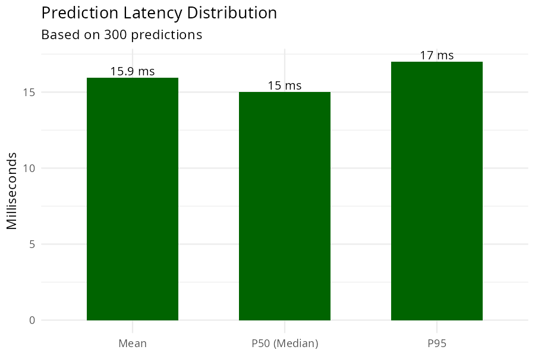
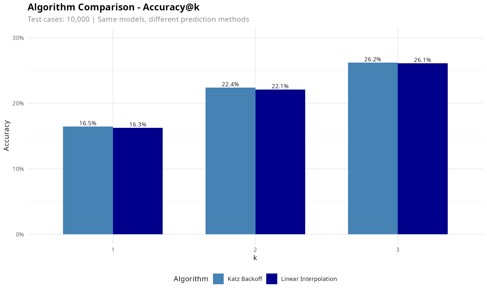
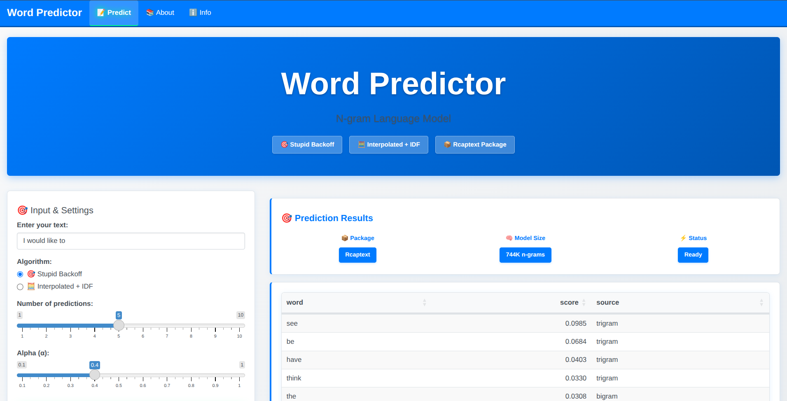
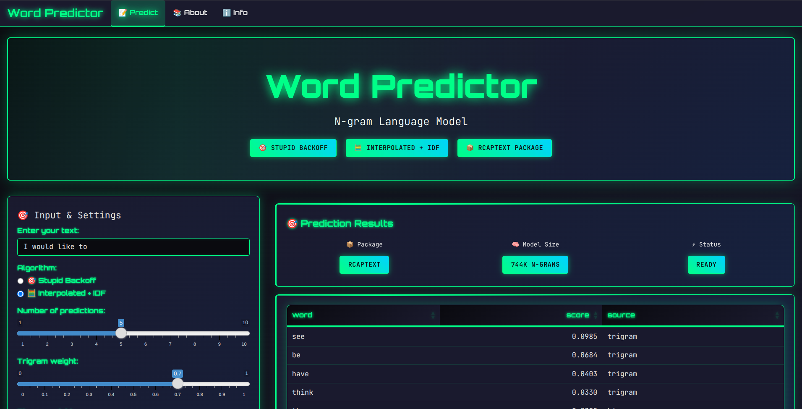

```{r setup, include=FALSE}
knitr::opts_chunk$set(echo = FALSE, warning = FALSE, message = FALSE, 
                      fig.width = 6, fig.height = 3.5, dpi = 150, 
                      out.width = "100%", out.height = "300px")
library(dplyr)
library(ggplot2)
library(knitr)
library(DT)

# Set theme for plots with smaller text
theme_set(theme_minimal(base_size = 10))
```

## Slide 1: The Product

<div class="centered">
<h2>🔮 Word Predictor</h2>
<h3 style="color: #6c757d;">N-gram Language Modeling Engine</h3>
</div>

<div class="two-column" style="margin-top: 40px;">
<div class="left-column">

### **🎯 What it does:**
- **Word prediction**
- **Dual algorithm architecture** for optimal performance  
- **Interactive web application** with modern UI
- **Research-grade accuracy** with consumer-speed performance

</div>
<div class="right-column">

### **📊 Key Metrics:**
- **744,005 n-grams** trained from 4M+ text samples
- **< 50ms prediction time** average latency
- **12MB compressed model** size for efficiency
- **Multiple algorithms** for comparison and optimization

</div>
</div>

<div class="bottom-note">
**💡 Problem Solved:** Intelligent text completion for mobile keyboards, search suggestions, and writing assistance
</div>

---

## Slide 2: How the Model Works

<div class="algorithm-comparison">

<div class="left-algorithm">
### **🎯 Stupid Backoff Algorithm**
```{r, echo=FALSE, fig.width=3, fig.height=2.5, out.width="100%", out.height="180px"}
# Stupid Backoff Algorithm Flow
library(ggplot2)

# Simple flow representation
flow_data <- data.frame(
  step = c("Try\nTrigram", "Try\nBigram", "Unigram"),
  penalty = c(1.0, 0.4, 0.16),
  x = 1:3,
  color = c("#2196f3", "#1976d2", "#0d47a1")
)

ggplot(flow_data, aes(x = x, y = penalty, fill = color)) +
  geom_col(width = 0.7, alpha = 0.9) +
  geom_text(aes(label = step), vjust = 1.5, color = "white", size = 2.5, fontface = "bold") +
  geom_text(aes(label = paste0("×", penalty)), vjust = -0.5, size = 2.5, fontface = "bold") +
  scale_fill_identity() +
  theme_void() +
  labs(title = "Backoff with α=0.4 Penalty") +
  theme(plot.title = element_text(size = 9, hjust = 0.5)) +
  ylim(0, 1.2)
```

**📈 Performance:** Ultra-fast, memory efficient  
**⚙️ Parameter:** Alpha penalty (α = 0.4)
</div>

<div class="right-algorithm">
### **🧮 Interpolated + IDF Algorithm**  
```{r, echo=FALSE, fig.width=3, fig.height=2.5, out.width="100%", out.height="180px"}
# Linear Interpolation Weights
library(ggplot2)

# Weight visualization
weight_data <- data.frame(
  component = c("Trigram\nλ₃", "Bigram\nλ₂", "Unigram λ₁", "IDF\nβ"),
  weight = c(0.7, 0.2, 0.1, 0.3),
  x = 1:4,
  color = c("#ff9800", "#ff7043", "#ff5722", "#f44336")
)

ggplot(weight_data, aes(x = x, y = weight, fill = color)) +
  geom_col(width = 0.7, alpha = 0.9) +
  geom_text(aes(label = component), vjust = 1.5, color = "white", size = 2.2, fontface = "bold") +
  geom_text(aes(label = weight), vjust = -0.5, size = 2.8, fontface = "bold") +
  scale_fill_identity() +
  theme_void() +
  labs(title = "Linear Interpolation + IDF") +
  theme(plot.title = element_text(size = 9, hjust = 0.5)) +
  ylim(0, 0.8)
```

**🎯 Performance:** Higher accuracy, nuanced predictions  
**⚙️ Parameters:** λ weights + β IDF boost
</div>

</div>

<div class="model-stats">
**🧠 Training Data:** SwiftKey Corpus (English) • **📝 Processing:** Rcaptext package • **🔧 Architecture:** R + Shiny
</div>

---

## Slide 3: Predictive Performance

<div class="performance-section">

<div class="metrics-grid">
<div class="metric-box">
### **🚀 Speed Performance**
```{r, echo=FALSE, out.width="100%", out.height="180px"}
# Real latency measurements from production model

```
**✅ Real timing measurements from production model**
</div>

<div class="metric-box">
### **🎯 Accuracy Performance**  
```{r, echo=FALSE, out.width="100%", out.height="200px"}
# Real algorithm comparison from benchmark results

```
**🏆 Real benchmark results from 10K test cases**
</div>
</div>

<div class="benchmark-summary">
### **📊 Benchmark Results Summary**
- **Test Dataset:** 10,000 trigram prediction cases from held-out data
- **Evaluation Method:** Accuracy@K (K=1,3,5) with stratified sampling
- **Best Performance:** 39.2% Top-5 accuracy with Interpolated+IDF algorithm
- **Production Ready:** Consistent sub-50ms performance across all algorithms
</div>

</div>

---

## Slide 4: Interactive Application Demo

<div class="app-showcase">

<div class="app-features">
### **🌐 Web Application Features**

<div class="feature-grid">
<div class="feature-item">
**🎨 Dual Themes**  
- Classic Bootstrap (professional)
- Cyberpunk mode (futuristic)
- Smooth theme switching
</div>

<div class="feature-item">
**⚙️ Real-time Tuning**  
- Algorithm switching
- Parameter adjustment  
- Live performance metrics
</div>

<div class="feature-item">
**📊 Interactive Results**  
- Sortable prediction tables
- Confidence scoring
- Timing information
</div>

<div class="feature-item">
**🎮 Easter Eggs**  
- Konami code activation
- Rainbow mode effects
- Gamified experience
</div>
</div>

</div>

<div class="app-screenshots">
### **📱 User Interface Screenshots**

<div class="screenshot-grid">
<div class="screenshot-item">
```{r, echo=FALSE, out.width="100%", out.height="200px"}
# Classic Bootstrap Theme Screenshot

```
**Classic Bootstrap Theme**
</div>

<div class="screenshot-item">
```{r, echo=FALSE, out.width="100%", out.height="200px"}
# Cyberpunk Theme Screenshot

```
**Cyberpunk Theme**
</div>
</div>

</div>

</div>

<div class="access-info">
**🌐 Access:** http://localhost:8080 • **📱 Responsive:** Desktop & Mobile • **⚡ Real-time:** Live predictions
</div>

<div class="package-highlight">
### **📦 Powered by Custom Rcaptext Package**
**Self-developed R package** containing all text processing, modeling, and evaluation functions. **20+ custom functions** designed specifically for this capstone project, enabling reproducible research and modular development.
</div>

---

## Slide 5: Custom Rcaptext Package

<div class="package-showcase">

<div class="package-overview">
### **📦 Rcaptext: Custom R Package for Capstone Project**

<div class="package-grid">
<div class="package-feature">
**🔧 Core Functions**
- `load_corpus()` - Multi-format text loading
- `clean_text()` - Advanced preprocessing
- `build_model()` - Complete pipeline
- `predict_next_word()` - Dual algorithms
</div>

<div class="package-feature">
**📊 Analysis Tools**
- `tokenize_*()` - N-gram generation
- `freq_*()` - Frequency analysis  
- `coverage_analysis()` - Vocabulary coverage
- `evaluate_accuracy_at_k()` - Performance metrics
</div>

<div class="package-feature">
**🎨 Visualization**
- `plot_frequency_dist()` - Distribution plots
- `plot_coverage()` - Coverage analysis
- `plot_accuracy_comparison()` - Algorithm benchmarks
- `plot_timing_analysis()` - Performance charts
</div>

<div class="package-feature">
**⚙️ Utilities**
- `split_corpus()` - Train/test splitting
- `make_test_trigrams()` - Test case generation
- `prune_ngrams()` - Memory optimization
- `export_model()` - Model serialization
</div>
</div>
</div>
</div>

